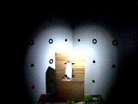

This documentation presents the results and implementation details of a method for scanning a surface's Bi-Directional Reflectance Distribution Function, or short BRDF. This method was developed by Christian Thurow and Christopher Leiste
as a project within one semester as part of the course "Rapid Prototyping" (winter term 2011/12) at <a href="http://www.cg.tu-berlin.de/">Technical University Berlin</a>.
      
Our main goal was to aquire surface properties regarding its light reflectance of real objects as accurate as possible given the limited equipment of an off-the-shelve webcam and a <a href="http://www.david-laserscanner.com/">DAVID Laserscanner</a>. Together with a 3D model of the object, the BRDF description of its surface reassembles a real object quite well and makes it possible to render this               object realistically and also manufacture replicas of the object with modern rapid prototyping 3D printers. But before we go into detail of our implementation, we have to have a look at the BRD function, briefly its theory and complexity to fully understand its basic idea and importance.

Figure 2: Geometry of Reflection

The BRDF describes how incident light is reflected on a surface. The amount and direction of the reflected light
depends on the surface normal vector-N, the direction of the incident light vector-L, the position of the spectator(vector-V),
and material specific coefficients that are the unknowns in our estimation process. The coefficients tell us about the amount of diffuse light (kd), specular light (ks) and the specular hardness(n), respectively. In the field of Computer Graphics, there are several different established reflectance models. Among others, two very common models are the <a href="http://www.cs.northwestern.edu/~ago820/cs395/Papers/Phong_1975.pdf">Phong reflection model</a> and the
<a href="http://citeseerx.ist.psu.edu/viewdoc/download?doi=10.1.1.131.7741&rep=rep1&type=pdf">Blinn-Phong model</a>, which are described by the following formulas.

Where H is the half-vector between V and L, and R is the mirrored version of L at N.
Figure 2 shows the angular relations of the reflectance problem. The BRDF Estimation problem has multiple dimensions making
this a complex task. Besides the 3-dimensional angular relations, involving the state of the 3 vectors N,L and V, each point of
the surface can have different reflectance properties, also each wavelength of light may be reflected differently.
However, once a full BRDF formula for each wavelength and each point on the surface has been acquired, the surface properties are fully
described (except for subsurface scattering) in the sense of light interaction, leading to many new possible applications.

Implementation:

In order to build a BRDF Scanner, several components are needed. What we alredy had access to is a DAVID Laserscanner, constisting of a reference pattern, a webcam and a line laser. This gives us a 3D representation in form of an obj file. What is missing is a moveable light source in order to create different lighting conditions, covering a wide range of possible values in the BRD equation. We chose to integrate the light source into a scanner skeleton, which is described in detail in the Implementation – Hardware section. Once measurements are taken, we have discrete values for certain angles, so we need a software that calculates and may render a full BRDF. The latter is described in the Implementation – Software section.

Hardware:

Meaningful measurements for BRDF estimation can be acquired by taking pictures of the scene, having the camera at a static position, but moving a point light source to predefined spots. This basic idea is demonstrated in Figure 1. We chose to go with multiple light sources turned on one at a time rather than a moveable light source for the sake of much easier implementation. For this we use a 4x4 matrix of super bright white LEDs with a wide angle of radiation which are aligned concentrically around the centre of the scene in different heights. This makes it easier later in the estimation process, because the positions of the discrete light sources are known and can be hard-coded. The following images show photos taken during the building process.

Figure 2: Building the Skeleton 1

Figure 3: Building the Skeleton 2
				
We built the frame out of 0.8cm scantling timber, 0.5cm for the cross beams respectively. For the bended beams we used a laser cutter to cut thin layers of artificial wood, since these layers are too thin to hold their own weight over the length of more than 30cm, we glued 3 of them together to create a very solid structure. The template for the bended beams can be downloaded from this page in the <a href="download.html">Downloads</a> section. The template also already includes slots for the LED legs. Only a fraction of them is used by our 16 leds, this however makes the frame easily extensible. All beams are glued together making it a very rigid structure. The frames dimensions are built so that the calibration scheme of the laser scanner slots perfectly into place.

Figure 4: Finished Skeleton
               

Figure 5: Finished Skeleton backside
				
At this point, the skeleton is finished, but the structure is still missing the point light sources. LEDs are slot into the perforated bended beams, with the LED's pointing inwards. The wiring of the LED matrix is implemented so that only one LED may be lit at a time. For controlling the LEDs we use a standard microcontroller. We chose the <a href="http://www.arduino.cc/">Arduino</a> Uno for its many output ports as well as ease of programmability and low asset cost. We chose a very simple matrix circuit utilising 8 ports of the arduino and just 4 resistors to protect the LEDs from to high currents. The circuit can be found in Figure 6.
				

Figure 6: LED wiring
			
The following images illustrate the wiring process.

Figure 7: Arduino Socket

Figure 8: Wiring the LEDs

With the wiring complete, the Arduino needs to get programmed. To not overstrain the power supply of the board and due to the type of the circuit it is only possible to use one LED at a time. Which in turn is exactly what we want for taking the measurements later on. The following table describes how the output ports of the microcontroller need to be allocated to let only one LED be on.
				
For demonstration purpose the microcontroller software is set to continously changing LED ports in the following video: 
http://www.youtube.com/embed/4pmlsCcu2N8

The software to control the LEDs can be found in the Arduino folder.

With having build the frame, wired the LEDs and coded software for the microcontroller, the hardware part is complete.
Figure 9 and 10 show the frame integrated with the DAVID laserscanner.

Figure 9: BRDF Scanner
					

Figure 10: BRDF Scanner, different view
	
Software:

Figure 1: High Level Overview of Algorithm

The software we wrote computes the BRDF for our object based on images that are taken when the object is illuminated by exactly one light source in a pre-defined position. We already built the hardware to do this in the previous step. Now there are some preparations necessary to get all the data we need. To do 3D rendering, a model has to be created from the real-world object. Luminosity values can be gained by taking images with a digital camera or webcam and evaluate the pixel values of the resulting image. We also need to know the exact positions of the camera, the object, and the light sources. Also important is the orientation and field of view of the camera. When this data is collected, the actual BRDF calculation can be done. The luminosity values gained from the images have to be 	associated with points on the surface of the object and all data put in the algorithm. When the calculation is done, it can be rendered on screen to approximate the reflection behaviour of the object's surface on the basis of a reflection model.
	
Preparations

First of all, we need a 3D model to represent our scene. We used the DAVID Laserscanner Software to get that. It works together with an arbitrary webcam, in our case a simple Logitech model, a line laser, and a calibration grid. 

<h2>Program Usage</h2>

Following is a step by step description how to use our system, from scanning the object to using the software to estimate the BRDF.

<h3>Acquiring Measurements</h3>
		
<h4>Step 1: Acquire 3D Model</h4>
In order to acquire the 3D model, the camera needs to be in position and calibrated. Once the calibration is finished, the installation must not be moved again to ensure the correct assignment of all future mesh vertices. The calibration parameters are saved into a file that we need later to get the position and orientation of the camera in relation to the scene. All LEDs must be switched off, all background light reduced to a minimum and the DAVID Laserscanner software started. The object to be scanned is now placed in the scene. Artificial lights are being switched off and curtains closed to avoid the camera being distracted from the laser by unwanted light sources. The line laser is then being held above camera, pointing towards the scene so that the line crosses the left and right edges of the images that the webcam sees. The angle between the camera and the laser, as seen from the object being scanned, is supposed to be in an interval that ensures the underlying algorithm to operate with as few aberration as possible. Very low (&alpha;&lt;30&deg;) and very high angles (&alpha;&gt;60&deg;) produce triangles between the camera, laser, and scene mesh that increase small errors that already arose from imperfections in the set-up components. 
The scanning process is complete as soon as the camera has assigned every pixel on the object to a laser line that is suitable to calculate the depth in 3D space of the assigned vertex on the model. The result can be saved as an obj file. The instructions for scanning are also available on the DAVID HowTo website. Bare in mind that too reflectant objects are not possible to scan, they also need to be within a certain size to fit in the scene. Also important is the camera calibration file that is also produced by the DAVID laserscanner software. This XML file will be later used by our software to align the 3D object in the virtual 3D world.
		
<h4>Step 2: Take BRD measurements</h4>
Once the model and the camera calibration file is acquired, the actual BRD measurements can be taken using the camera. The camera needs to be in the exact position as in the first step. We will now take 16 images, one image for each LED. We used VLC Player to access the camera directly, there we can define the resolution of the camera and take screenshots.For taking the images it is crucial to elimante all background light. Which is achieved easily by covering the scanner skeleton with a black woll sheet. To further eliminate sensor noise, we take a dark image, that we will later subtract from the actual 16 measurements.

It is now time to connect the Arduino to a PC and start the LED controlling software. Switch the first LED on by calling OneON(1, 0); in the "loop" function of the software. The camera settings are very important in this step, since they influence the quality of the BRDF Estimation. Set the camera so that with one LED on, the image is neither oversaturated nor too dark or unrealistic in terms of color. For our test camera, the Logitech WebCam Pro 9000, we found the following settings to be useful.	

Figure 1: Camera Settings						

With the camera all set up, establish a connection with the camera via the VLC Player and set the resolution to 800x600 pixel. Now take one picture for each LED, each time changing the arduino software by increasing x in "OneON(x, 0);" and uploading it to the microcontroller. You will need the Arduino Java Programming Environment, which can be downloaded from the Arduino homepage to load the led controller software.
Now take a screenshot of the camera image in VLC Player and save it as x.png, where x is the number of the current LED, beginning with 1. Also save the dark image with no LED on as dark.png. These images may look like the following. 

1

2

3

4

5

6

7

8

9

10

11

12

13

14

15

	

16

dark image

image with background light			

			
<h3>Estimating and Rendering the BRDF</h3>
		
All is now acquired for the main software that estimates and renders the BRDF as a 3D representation.
		
<h4>Step 3: Set up the Program</h4>
Open the project file("BRDF.sln") with MS Visual Studion 2010 and go into the main.cpp file. In line 33, change the path of 	LoadModel(..) to the path of the obj file. In line 46 change the path to the file of the camera calibration file of 			LoadCameraParameters(..). 
				
Now go to the file brdfdata.cpp and change the path in line 20 to the path where the 16 images are located. Remember that they need to be named 1. to 16."filextension". Now set the correct file extension in line 23. By default these paths are "img" located in the project folder. 	

<h4>Step 4: Align the 3D model with the input images</h4>
Our software tries to automatically align the 3D model with the real world camera, however this does not always work perfectly 		due to imperfections in the camera calibration and due to lens distortion. 

Start the program via Visual Studio 2010. If everything was set up correctly, You will now see the mesh loaded and illuminated by a point light source positioned where the camera is. This is the position that was estimated by the program automatically according to the camera calibration file. As shown in the following figure.

Figure 2: Scene at Program Start						
				
If the position and perspective of the object does not match the object as in the measurement images, then the BRDF estimation will be 	incorrect. We found it practical to compare the openGL representation with one of the 16 images using an image editing tool such as GIMP. To do this, simply open one of the 16 measurement images and take a screenshot of the opengl scene. Then insert the screenshot as a new layer over the image. Now make sure the layers are transparent so you can see both layers. As demonstrated by the following figure.

Figure 3: Matching the Scene with the Measurement Image	
				
It is possible to move the camera position by using the keyboard keys as indicated in the top left of the openGL scene. Also the mouse can be used to move the center of the camera vector. If this does not sufficiently align the model with the measurement images, the field of view horizontally and vertically may be altered. Also using the keyboard keys as indicated in the top left of the openGL scene in the onscreen display. You can always go back to the default view however by pressing 'r'. Once the alignment is complete, we can proceed to the next step.

<h4>Step 5: Calculate the BRDF Equations</h4>
Press 'c' to calculate the BRDF. This process may take a long time, depending on the size of the object, resolution of the images, amount of images, the complexity of the scene and of course the processing speed of the PC. The status of the calculation can be seen in the console output of the program. When the output on the console indicates completion, the user may press 'p' to see the mapping between openGL scene and 2D screen coordinates to verify that the object was aligned properly. The anticipated result of this is shown in Figure 4.

Figure 4: Mapping						
By pressing 'm' the model is rendered using the BRDF just obtained. The model can now be moved and rotated using the mouse and keys mentioned to see the effects of different lighting conditions on the material. As illustrated by Figure 5.
				

Figure 5: Rendered BRDF

The average values for the BRDF equation: kd, ks and n are printed to the console.

<h3>Get Position of LEDs</h3>
As we placed our light sources fixed on bended beams that form sectors of a circle with the origin of our model space as the center, we are able to calculate the position of each LED using its beam's height and its angle on the virtual circle to get the other two coordinates.

<h3>Step 1: Calc Pixel to Surface Mapping</h3>
We want our model to be viewable on screen from any direction. Depending on the position of the viewer, we want every spot on the object to reflect light in the manner it is supposed to, based on the currently used reflection model.  On the images we already took we can see our object illuminated from different angles, giving us rays that were reflected in a specular, mirror-like manner and also candidates for diffuse reflection. Before we can do any calculation concerning luminance or reflection rates, we have to know where to apply our measured data on the model. In order to do that, we render the scene in OpenGL and put the OpenGL camera on exactly the place in model space where our real webcam is in object space. To get an exact match of the edges in the real image and the rendered one, some fine-adjusting is necessary to compensate inaccurate data previously measured.  As soon as we have reconstructed the real camera's view, we can utilize the OpenGL gluUnproject function which takes a two-dimensional input describing the position of a pixel on screen and results in the directional vector from the viewer to our object that this pixel represents. We can now check for each triangle on our model if the resulting ray of light hits it and which of them is hit first. That is the one we are interested in.

<h3>Step 2: Solve BRDF Equation</h3>
In order to render the model from every perspective, we not only need the reflection values from the original viewer's position but rather information about how much light is specularly reflected (coeffficient ks), how much light is diffusely reflected (coefficient kd), and how concentrated the diffuse reflection is around the ideal specular reflection direction. Those are our three unknowns that solve the non-linear equation of our current reflection model.  To solve it, we use the Levenberg-Marquardt algorithm that combines the advantages of two other algorithms used for solving equations in least squares manner &ndash; the Gauss-Newton algorithm and the method of gradient descent. We use this algorithm because of its robust nature finding a minimum of the input function even if the starting values of the iteration are far away from the final solution.  To get our three unknowns, we run the Levenberg-Marquardt algorithm for each pixel of the input images that hits the observed object. The number of input values can be chosen at will. As we took 16 images with different positions of the light source, we have 16 of them. Two angles also go into the equation, depending on the currently used reflection model. The Phong model needs the angle between ideally reflected beam and observer. The Blinn-Phong model needs the one between the normal vector of the illuminated triangle and the corresponding half vector. Both models also need the angle between light source and face normal. 

All calculations were done for each color channel, R,G and B individually.
	

<h3>Step 3: Render</h3>
The rendering is done in OpenGL using the data of the scanned model. The user can then choose if the model is displayed in unicolored, or if the calculated BRDF will be used to define reflection behaviour. In the latter case, a self-made shader comes into action that computes the illumination of each spot on the model depending on the camera's location. To do that, the formula of the currently defined reflection model is filled with the angles for light source, face normal, reflected light ray, half vector and observer vector as well as the estimated paramters from the previous step. This results in a number characterizing the luminosity from this spot on the model towards the observer.

Despite of having a complex software consisting of thousands of lines of code, the main loop of the BRDF solver can be simplified quite well by the following pseudo code. 

Figure 2: Pseudo Code of BRDF Solver

Results:
